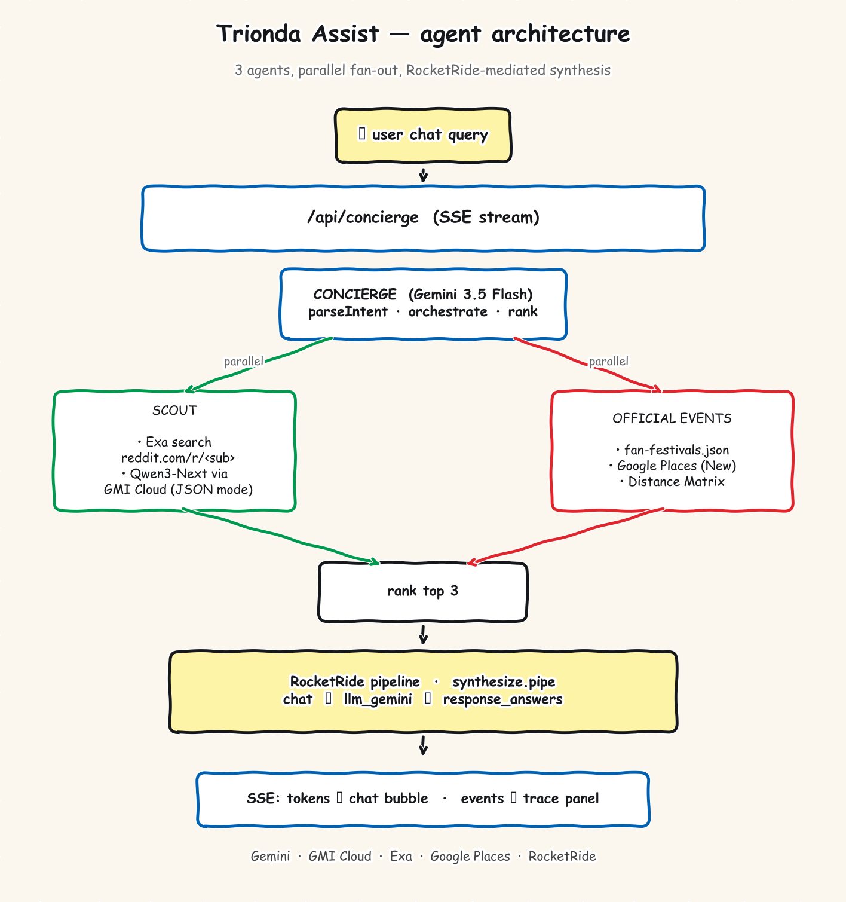

# Trionda Assist

**🔗 Live demo: [trionda.vercel.app](https://trionda.vercel.app/)**

A hand-drawn World Cup 2026 travel companion for the 16 host stadiums across the US, Canada, and Mexico. Browse a sketchy real-geo map, dig into per-stadium pages with real fixture schedules and live "spots nearby" data, and ask the floating chat agent for local tips.

Built at the **GDG × RocketRide × GMI Cloud** hackathon (May 2026).

Stack: Next.js 14, TypeScript, Tailwind, d3-geo, rough.js.

## Architecture



Three agents fan out in parallel from each chat query, then converge into a RocketRide-mediated synthesis step:

- **Concierge** (Gemini 3.5 Flash) — parses intent into structured JSON, ranks candidates, synthesizes the final natural-language answer
- **Scout** (Exa + Qwen3-Next-80B via GMI Cloud) — semantic Reddit search across per-stadium subreddits, then JSON-mode venue extraction
- **Official Events** (Google Places New + curated FIFA fan-fest data) — finds real nearby venues, computes walking distance via Distance Matrix

The synthesis step runs through a RocketRide pipeline (`pipelines/synthesize.pipe`) when the local engine is reachable; otherwise the Concierge silently falls back to direct Gemini streaming and emits a `rocketride-fallback` trace event.

## Features

- **Map landing** (`/`) — pannable rough.js map of North America with 16 stadium pins; hover a pin to preview the venue in a bottom drawer
- **Stadium pages** (`/stadium/[id]`) — hero photo, real match schedule, travel info, and live Spots Nearby
- **Match schedule** — all 104 real World Cup 2026 fixtures sourced from Wikipedia, grouped by venue. Knockout entries honestly show `TBD vs TBD` because the bracket isn't drawn until the group stage finishes
- **Spots Nearby** — server-rendered per stadium, 5 categories (Food / Coffee / Shopping / Nightlife / Activities). Real Google Places (New) results with ★ ratings, prices, distances, and deep-link "open in maps ↗" buttons via `place_id`
- **Tickets buttons** — every ScheduleCard links to a per-match Google search that lands on the official FIFA match page
- **Trionda Assist chat** — floating agent on every page, streams via SSE
- **Live agent trace panel** — chat shows colored chips for `concierge`, `scout`, `official-events` with the current phase, in real time as the request runs
- **Storyboard** (`/storyboard`) — design preview of key screens

## Sponsor stack

| Sponsor | Role in the live app | Where in code |
|---|---|---|
| **RocketRide** | Declarative pipeline for the synthesis step | `pipelines/synthesize.pipe`, `lib/llm/rocketride.ts` |
| **GMI Cloud** | Hosts Qwen3-Next-80B-A3B-Instruct for Scout's venue extraction (OpenAI-compatible, sub-2s JSON mode) | `lib/llm/gmi.ts` |
| **Google** | Gemini 3.5 Flash (intent + synthesis), Places API (New), Distance Matrix | `lib/llm/gemini.ts`, `lib/maps.ts`, `lib/spots.ts` |
| **Exa** | Semantic search over Reddit (`includeDomains: reddit.com/r/<sub>`) for Scout | `lib/llm/exa.ts` |

## Quick start

```bash
git clone <repo-url>
cd trionda
npm install
cp .env.example .env.local
npm run dev
```

Open [http://localhost:3000](http://localhost:3000).

The default `.env.example` ships with `NEXT_PUBLIC_DEMO_MODE=true` — the chat endpoint serves canned responses from `data/canned-responses.json` instead of calling any external APIs. Everything else (map, stadium pages, schedule data) works without keys.

To wire up live agents, fill in the keys in `.env.local`, then:

```bash
NEXT_PUBLIC_DEMO_MODE=false  # in .env.local
npm run check-keys           # probes every configured key, reports OK/FAIL/UNSET
```

## Environment variables

See `.env.example` for the full list.

| Variable | Required? | Purpose |
|---|---|---|
| `NEXT_PUBLIC_DEMO_MODE` | yes | `true` = canned chat responses, no external API calls |
| `GEMINI_API_KEY` | live mode | Concierge intent parsing + synthesis fallback |
| `GMI_CLOUD_API_KEY` | live mode | Scout's venue extraction via Qwen3-Next |
| `GMI_CLOUD_MODEL` | live mode | Defaults to `Qwen/Qwen3-Next-80B-A3B-Instruct` |
| `EXA_API_KEY` | live mode | Scout's semantic Reddit search |
| `GOOGLE_MAPS_API_KEY` | live mode | Server-side Places + Distance Matrix calls |
| `NEXT_PUBLIC_GOOGLE_MAPS_KEY` | live mode | Client-side map render |
| `ROCKETRIDE_URI` | optional | WS endpoint for the RocketRide engine. Defaults assume local; the Concierge auto-discovers the ephemeral port via `lsof` when the URL points at `localhost:5565` |
| `ROCKETRIDE_APIKEY` | optional | Engine API key (`local-dev` for local mode) |
| `ROCKETRIDE_DISABLED` | optional | Set to `true` to always use direct Gemini streaming and skip the RocketRide attempt (e.g., on Vercel where there's no engine) |

Note on Gemini: the free tier is **20 requests / day**. Enable billing on the Google Cloud project at [aistudio.google.com/apikey](https://aistudio.google.com/apikey) to lift that to 1000/min. Chat will error with a clear `⚠️ Gemini API quota exhausted` message in the bubble when the limit hits.

## RocketRide locally

The synthesis pipeline runs through RocketRide's local engine when available. To enable:

1. Install the [RocketRide VSCode extension](https://marketplace.visualstudio.com/items?itemName=rocketride.rocketride).
2. Click **Connect to Server** in the RocketRide sidebar — extension defaults to local mode (no signup; cloud is coming soon).
3. Open `pipelines/synthesize.pipe` to see the 3-node pipeline canvas.
4. Run `npm run dev` and ask the chat a question — trace will show `synthesizing: RocketRide pipeline → llm_gemini` instead of `direct Gemini`.

If the engine isn't running, the Concierge auto-falls back to direct Gemini streaming and the trace emits `rocketride-fallback: <reason>`. The chat keeps working — the only difference is the synthesis transport.

## Scripts

| Command | Description |
|---|---|
| `npm run dev` | Start the Next.js dev server |
| `npm run build` | Production build |
| `npm run start` | Serve the production build |
| `npm run typecheck` | TypeScript check (no emit) |
| `npm run check-keys` | Probe every configured API key (Gemini, GMI, Exa, Google Maps), reports OK/FAIL/UNSET |
| `npm run smoke` | Smoke-test `/api/concierge` end-to-end against a running dev server |
| `npm run prewarm` | Hit the 4 demo stadiums with prepared queries to populate the in-memory agent cache before a live demo |

## Deployment

Live at **[trionda.vercel.app](https://trionda.vercel.app/)**.

Pushes to `main` auto-deploy to Vercel via `.github/workflows/deploy.yml`. Copy the same env vars from `.env.local` into the Vercel project (Settings → Environment Variables) for the **Production** environment.

⚠️ Set `ROCKETRIDE_DISABLED=true` on Vercel — the RocketRide engine is local-only and the deployed serverless function can't reach it. The deployed app falls back cleanly to direct Gemini streaming with the same agents and SSE contract.

Also set the Google Maps browser key (`NEXT_PUBLIC_GOOGLE_MAPS_KEY`) HTTP-referrer allowlist to include your Vercel domain (e.g., `*.vercel.app/*` and any custom domain).

## Project structure

```
app/                  Next.js App Router pages + API routes
  api/concierge/      Streaming chat endpoint (SSE)
  stadium/[id]/       Per-stadium detail pages (server-rendered with live Places data)
  storyboard/         Design storyboard preview
components/           UI — map, drawer, chat agent, stadium sections
lib/
  agents/             Concierge / Scout / Official Events
  llm/                Gemini / GMI Cloud / Exa / RocketRide clients
  maps.ts             Places (New) + Distance Matrix wrappers
  spots.ts            Per-stadium Spots Nearby (5-category Places fan-out)
  cache.ts            In-memory TTL cache for agent results
  stadiums.ts         16-stadium dataset + subreddit allowlists
data/
  schedule.json       All 104 World Cup 2026 fixtures grouped by venue (from Wikipedia)
  fan-festivals.json  Curated official fan-fest entries per host city
  canned-responses.json  Demo-mode chat replay
pipelines/
  synthesize.pipe     Live RocketRide pipeline (chat → llm_gemini → response_answers)
  concierge.pipe      Documentation of the full multi-agent migration target
public/
  stadiums/           Local stadium hero images (most pages pull from Wikimedia)
  docs/architecture.png  This README's diagram
scripts/              Dev utilities (check-keys, smoke, prewarm)
project/              Original Claude Design handoff (HTML wireframes; reference only)
```

## Notes & known caveats

- **Knockout-round teams show `TBD vs TBD`** — not a bug; the bracket isn't drawn until group stage finishes. Dates, times, and venues are real.
- **Mexican stadiums + English queries** often produce `scout · 0 reddit threads` because the relevant subreddits are mostly Spanish-language. The Concierge still completes via Official Events alone.
- **`concierge.pipe` is documentation**, not a running pipeline. It shows the full multi-agent target shape for when RocketRide adds custom tool-call components for Exa and Places. The live pipeline is `synthesize.pipe`.
- **First request after server start is slow (~5s)** — cold Gemini call + RocketRide pipeline startup. The agent activity panel fills up immediately so the user has visual reassurance.
